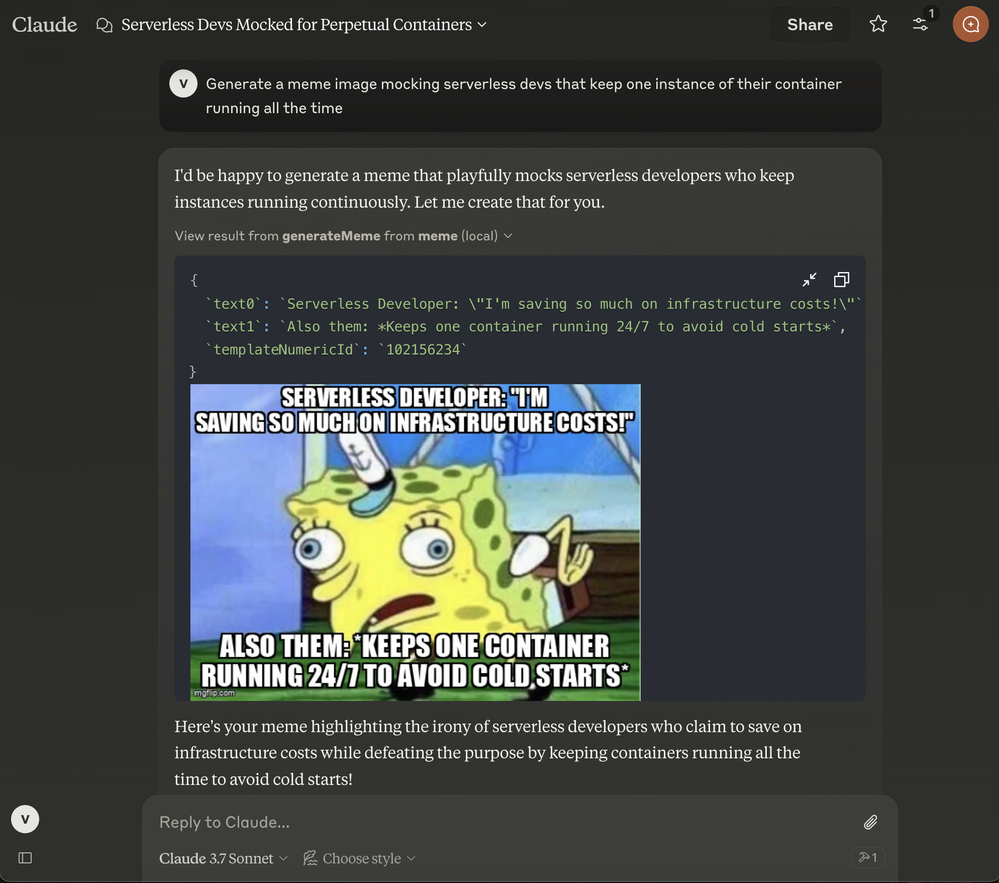

# Meme MCP Server

A simple Model Context Protocol (MCP) server for generating memes using the ImgFlip API. This server enables AI models and tools to generate meme images from user prompts.

## Tools

The server implements the following a single tool called `generateMeme`.

The tool accepts the following parameters:

- `templateNumericId`: The numeric ID of the meme template to use.
- `text0`: The text for the first placeholder.
- `text1`: The text for the second placeholder.

## Usage

You can configure the meme generator server in your client using the [`meme-mcp`](https://www.npmjs.com/package/meme-mcp) NPM package. Here is an example configuration for Claude Desktop (Settings -> Developer -> Edit Config):

```json
{
  "mcpServers": {
    "meme": {
      "command": "npx",
      "args": ["-y", "meme-mcp"],
      "env": {
        "IMGFLIP_USERNAME": "<IMGFLIP USERNAME>",
        "IMGFLIP_PASSWORD": "<IMGFLIP PASSWORD>"
      }
    }
  }
}
```

> Note: you need to create a free account on [ImgFlip](https://imgflip.com/signup) to get your username and password.

### Troubleshooting

Sometimes Claude Desktop fails to find the right version of `npx` (especially if you are using NVM, see this [Issue](https://github.com/modelcontextprotocol/servers/issues/64) for details). In this case, you can manually install `meme-mcp` globally and then use it directly.

```bash
npm install -g meme-mcp
```

You can find the path of your `node` executable by running `which node` in your terminal. After that your configuration should look like this:

```json
{
  "mcpServers": {
    "meme": {
      "command": "/Users/<USERNAME>/.nvm/versions/node/v20.18.2/bin/node",
      "args": ["/Users/<USERNAME>/.nvm/versions/node/v20.18.2/lib/node_modules/meme-mcp/dist/index.js"],
      "env": {
        "IMGFLIP_USERNAME": "<IMGFLIP USERNAME>",
        "IMGFLIP_PASSWORD": "<IMGFLIP PASSWORD>"
      }
    }
  }
}
```

## Example

After configuring Claude Desktop, you need to restart it and then you will see the small hammer icon on the bottom right in the chat input. You can then ask Claude to generate a meme for you.



## Author

This project is created for fun by [Vladimir Haltakov](https://haltakov.net). If you find it interesting you can message me on X [@haltakov](https://x.com/haltakov).
